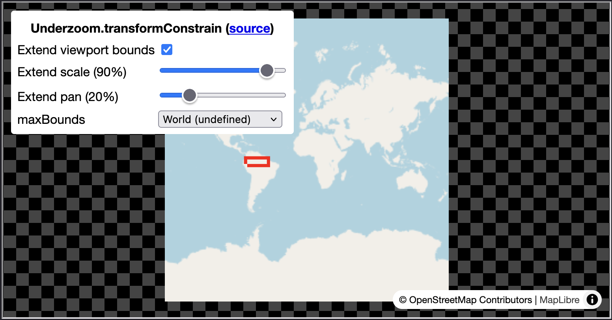

# maplibre-xy

Handy functions for <a href=https://github.com/maplibre/maplibre-gl-js>maplibre-gl-js</a> to improve flat single-copy maps, 'simple' maps, and non-maps like high-resolution images.

[Install](#install) with NPM:

```bash
npm install maplibre-xy
```

Or import modules as needed to your script from unpkg or locally from the repo's `/src`:

```js
import { Underzoom } from 'https://unpkg.com/maplibre-xy';
// or
import { Underzoom } from './src/index.js';
```

[Features](https://larsmaxfield.com/maplibre-xy/) include demos and code examples:

- [Underzoom](#underzoom): Responsibly zoom and pan to see the entire bounded map area.

<p align="center">
    <a href="https://larsmaxfield.com/maplibre-xy/examples/underzoom/">
        
    </a>
</p>

## Install

You can access the modules in a couple ways.

### NPM

```bash
npm install maplibre-xy
```

```js
import { Underzoom } from 'maplibre-xy'
```

### unpkg

```js
import { Underzoom } from 'https://unpkg.com/maplibre-xy';
```

### Source

You can also clone the repo or simply copy the `/src` folder contents:

```js
import { Underzoom } from './src/index.js';
```

Or just copy individual modules (like`/src/underzoom.js`) if you need just need those.


## Features

### Underzoom

Let users see the entire bounded area regardless of viewport aspect ratio.

<p align="center">
    <a href="https://larsmaxfield.com/maplibre-xy/examples/underzoom/">
        
    </a>
</p>
<p align="center">
    <a href="https://larsmaxfield.com/maplibre-xy/examples/underzoom/">
        Demo
    </a>
</p>

Simply create an `Underzoom` instance and pass its `transformConstrain` to the Map constructor's `transformConstrain` option:

```js
import { Underzoom } from 'maplibre-xy';  // NPM
// or
import { Underzoom } from 'https://unpkg.com/maplibre-xy';  // unpkg

const myUnderzoom = new Underzoom(maplibregl);  // Uses default limits

const map = new maplibregl.Map({
    transformConstrain: myUnderzoom.transformConstrain,
    ...
```

This is especially useful when `renderWorldCopies=false` to show the whole map on both mobile (a tall viewport) and desktop (a wide viewport). MapLibre's default transform doesn't allow this.

#### Customize

You can modify the limits by passing an options object. The [underzoom demo](https://larsmaxfield.com/maplibre-xy/examples/underzoom/) lets you preview the effect of each limit on various bounded areas:

```js
const underzoomOptions = {
    // Ratio (0-1) of how you far youcan zoom out
    // the bounds relative to the viewport size.
    extendScale: 0.5,  // Default 0.9

    // Ratio (0-1) of how far you can pan beyond
    // the bounds relative to the distance between
    // viewport edge and center.
    extendPan: 1.0,  // Default 0.2

    // Whether to enable or revert to default
    // Mercator constrain.
    extend: true  // Default true
};

const myUnderzoom = new Underzoom(maplibregl, underzoomOptions);
```

#### HTML example
```html
<!DOCTYPE html>
<html lang='en'>
<head>
    <title>Underzoom minimal example</title>
    <meta property='og:description' content='Underzoom minimal example' />
    <meta charset='utf-8'>
    <meta name='viewport' content='width=device-width, initial-scale=1'>
    <link rel='stylesheet' href='https://unpkg.com/maplibre-gl@5.10.0/dist/maplibre-gl.css' />
    <script src='https://unpkg.com/maplibre-gl@5.10.0/dist/maplibre-gl.js'></script>
    <style>
        body {
            margin: 0;
            padding: 0;
        }
        html, body, #map { height: 100%; }
    </style>
</head>
<body>
<div id='map'></div>

<script type="module">
    import { Underzoom } from 'https://unpkg.com/maplibre-xy';
    
    const myUnderzoom = new Underzoom(maplibregl, { extendScale: 0.5, extendPan: 1.0 });

    const map = new maplibregl.Map({
        container: 'map',
        renderWorldCopies: false,
        transformConstrain: myUnderzoom.transformConstrain,
        style: {
            version: 8,
            sources: {
                rgb: {
                    type: 'raster',
                    tiles: ['https://a.tile.openstreetmap.org/{z}/{x}/{y}.png'],
                    tileSize: 256,
                    attribution: '&copy; OpenStreetMap Contributors',
                    maxzoom: 19
                },
            },
            layers: [
                {
                    id: 'rgb',
                    type: 'raster',
                    source: 'rgb'
                },
            ]
        },
    });
</script>
</body>
</html>
```

## Contributing

Feature requests, bug reports, and pull requests are always welcome.
